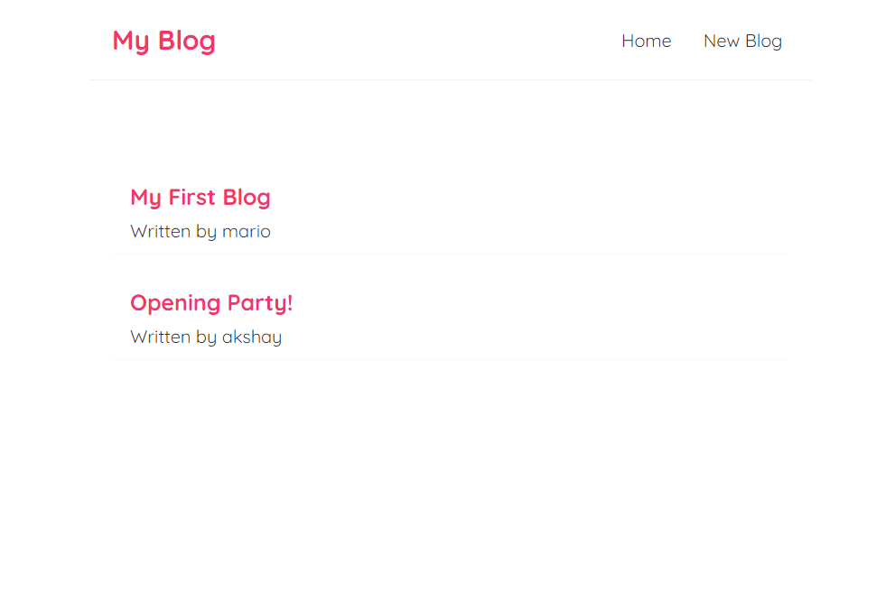
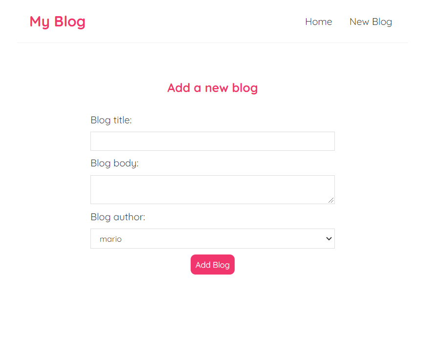
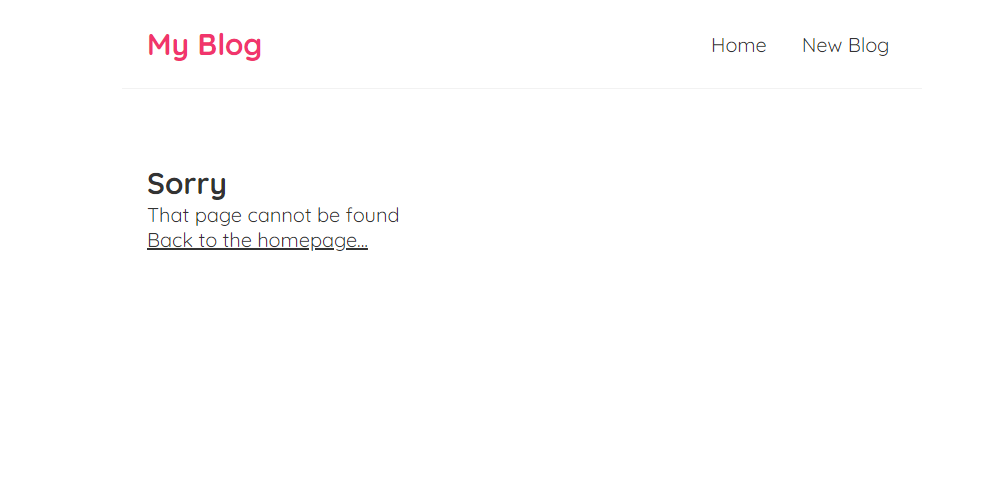

# My Blog App

- Blog app created by me from the tutorial of NetNinja's [React Course](https://www.youtube.com/playlist?list=PL4cUxeGkcC9gZD-Tvwfod2gaISzfRiP9d) on Youtube.

- Simple blog app which lets you create the blog & read it, and if you don't like it then delete it.

- Covers the fundamentals of React with custom hooks & react-router-dom library to redirect to different pages.

- You redirect to 2 pages in the url i.e `Home("/")` & `AddBlog("/create")`.

- Type any other url & you will be redirected to the `Error` page.

## How to Run this Project on your Local Machine

### Start the JSON Server

- `npx json-server data/db.json --watch --port 8000`

**In another terminal, run:**

- `npm start` Runs the app in the development mode. Open [http://localhost:3000](http://localhost:3000) to view it in the browser.

## Screenshots

---

---

